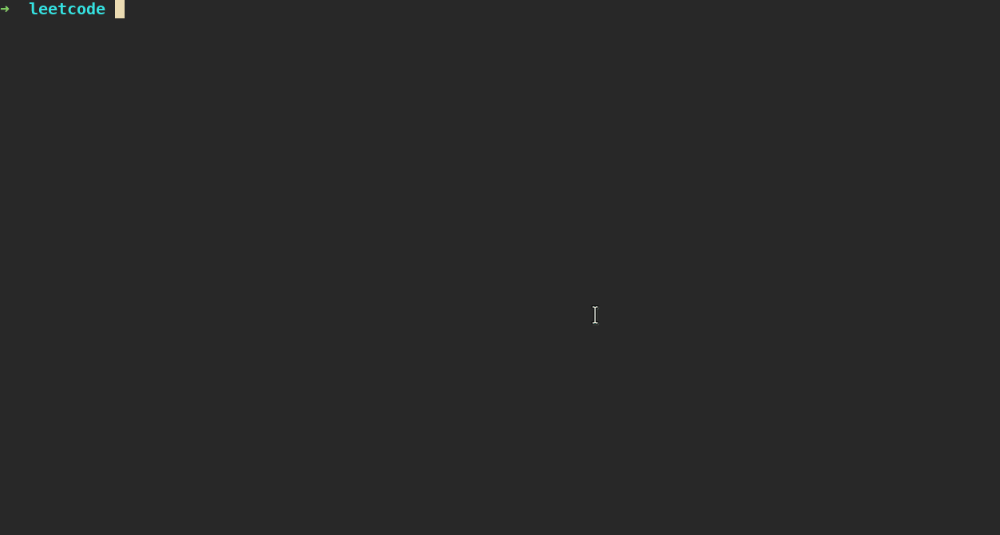

# leet-cli

Program used to retrieve Leetcode problems in the terminal.

### Check it out



### Synopsis

Get a random problem from Leetcode based on difficulty and/or topic.

```
leet [flags]
```

Examples:

```
leet -d hard -t dynamic-programming
leet -d medium -t array,two-pointers
```

### Options

```
      --config string       config file (default is $HOME/.leet.yaml)
  -d, --difficulty string   difficulty of problem to select (default "all")
  -h, --help                help for leet
  -p, --paid                include paid/premium problems
  -t, --topics strings      topic(s) to select problem from (comma-separated, no spaces)
```

## Commands

### leet complete

Mark one or more problems complete, prevening them from showing up when requesting
a random problem.

```
leet complete [flags]
```

Examples:

```
leet complete 1337
leet complete 52 12 628
```

#### Options

```
  -h, --help   help for complete
```

---

### leet incomplete

Mark more ore more problems, allowing them to show up when requesting a random problem.

```
leet incomplete [flags]
```

Examples:

```
leet incomplete 1337
leet incomplete 628 12 52
```

#### Options

```
  -h, --help   help for incomplete
```

---

### leet stats

Print details about completed questions per category and difficulty.

```
leet stats [flags]
```

#### Options

```
  -d, --difficulty string   difficulty of problems to print with stats (default "all")
  -h, --help                help for stats
  -p, --paid                include paid/premium questions
  -t, --topic string        topic of problems to print with stats (comma-separated, no spaces)
```

---

### leet list

Print a list of the Leetcode problems, filtered by difficulty and/or topic.

```
leet list [flags]
```

Examples:

```
leet list
leet list -d easy -t array,string
```

#### Options

```
  -c, --completed           list only completed problems
  -d, --difficulty string   difficulty of problems to list (default "all")
  -h, --help                help for list
  -i, --incomplete          list only incomplete problems
  -p, --paid                include paid/premium problems
  -t, --topics strings      topic(s) of problems to list (comma-separated, no spaces)
```

---

### leet get

Lookup one or more problems by Leetcode ID.

```
leet get [flags]
```

Examples:

```
leet get 521
leet get 72 1262 980
```

#### Options

```
  -h, --help   help for get
```

---

### leet topics

List all problem topics on Leetcode.

```
leet topics [flags]
```

#### Options

```
  -h, --help   help for topics
```
